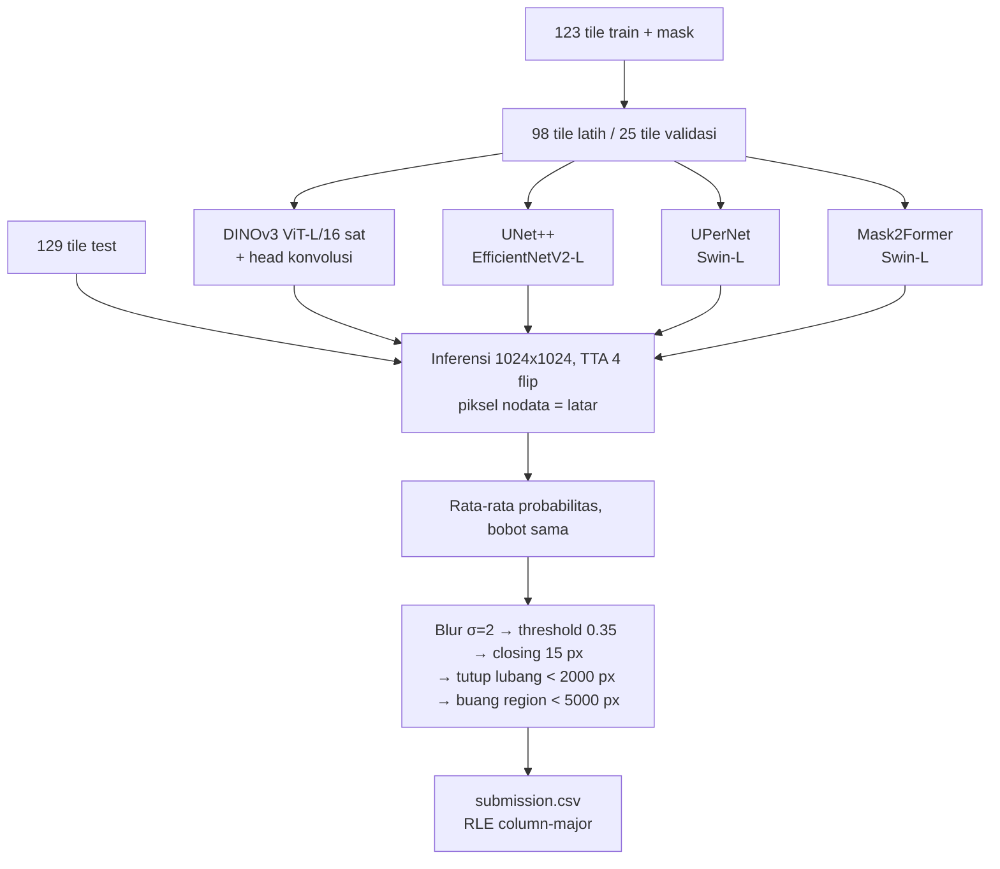

# HoloMine Paddy Field Segmentation — Babak Final

Segmentasi biner lahan sawah pada tile citra Pléiades 1024×1024 (Sepatan Timur, Tangerang).
Repositori ini berisi pipeline lengkap untuk melatih ulang solusi dari nol dan menghasilkan `submission.csv`.

Solusinya adalah **ensemble empat model segmentasi** yang dilatih pada tile train berlabel, diikuti perapian
bentuk mask. Input: file kompetisi (`train/images`, `train/masks`, `test_images`, `sample_submission.csv`)
dan backbone pretrained publik.

## Alur



## Arsitektur model

| Nama | Encoder | Decoder | Pretraining | Sumber bobot |
|---|---|---|---|---|
| `dinov3_sat` | DINOv3 ViT-L/16 | head konvolusi ringan pada 4 lapis antara (1/16 → 1/4 → resolusi input) | SAT-493M (citra satelit) | timm `vit_large_patch16_dinov3.sat493m` |
| `unetpp_effv2l` | EfficientNetV2-L | UNet++ | ImageNet | timm `tf_efficientnetv2_l` |
| `upernet_swinl` | Swin-L | UPerNet | ImageNet-22k + ADE20K | HF `openmmlab/upernet-swin-large` |
| `mask2former_swinl` | Swin-L | Mask2Former | ImageNet-22k + ADE20K | HF `facebook/mask2former-swin-large-ade-semantic` |

Keempatnya berbeda cara kerjanya: ViT dengan pretraining satelit, CNN dengan skip connection rapat, transformer hierarkis
dengan pyramid pooling, dan klasifikasi mask berbasis query. Kesalahan tiap model berbeda, sehingga rata-rata
probabilitasnya lebih baik daripada model mana pun sendirian. Bobot ensemble sama rata, tanpa penyetelan.

### Pelatihan (sama untuk semua model)

| Komponen | Nilai |
|---|---|
| Input | crop acak 25–100% luas tile, di-resize ke 768×768; 4 crop per tile per epoch |
| Augmentasi | flip horizontal/vertikal, rotasi 90°, brightness/contrast ±0.2, hue/saturation ringan |
| Normalisasi | mean/std pretraining backbone (ImageNet; statistik satelit untuk DINOv3-sat) |
| Loss | BCE + Dice, Dice dihitung per batch searah metrik micro-IoU. Mask2Former memakai loss set-prediction bawaannya |
| Optimizer | AdamW, lr 1e-4 (head/decoder), 1e-5 (backbone pretrained DINOv3 dan Swin), weight decay 1e-2, one-cycle dengan warm-up 5% |
| Batch / presisi | 4 / mixed precision (Mask2Former fp32) |
| Epoch | 60 |
| Validasi | 25 dari 123 tile train ditahan (satu lipatan dari permutasi acak tetap) |

### Catatan validasi

Tile dipotong dengan stride 512 px, sehingga tile bertetangga berbagi separuh luasnya. 15 dari 25 tile validasi
berbagi lahan dengan tile train, jadi skor validasi lebih tinggi daripada skor pada blok test yang terpisah secara
spasial. Skor validasi dipakai sebagai cek kewajaran, bukan untuk memilih bobot ensemble. Analisisnya ada di notebook
(bagian 1.4 dan 2.1); `tile_groups()` menemukan kuadran yang sama langsung dari piksel.

### Inferensi dan pasca-proses

- Tile penuh 1024×1024, test-time augmentation 4 flip, rata-rata probabilitas.
- Piksel hitam murni (nodata, di luar jejak citra) ditetapkan sebagai latar; di data train 99% piksel nodata adalah latar.
- Label train berupa poligon kasar (rata-rata kurang dari satu lubang kecil per tile), sedangkan prediksi mentah berisi
  ratusan lubang dan serpihan. `postprocess()` merapikannya:

| Blur σ | Threshold | Closing | Tutup lubang | Buang region |
|---|---|---|---|---|
| 2 | 0.35 | 15 px | < 2000 px | < 5000 px |

Konstanta ini tertulis di bagian atas `paddy_repro.py` (`FINAL`).

## Struktur repositori

```
paddy_repro.py                                 seluruh pipeline dalam satu file: model, training, ensemble, pasca-proses, RLE
modal_app.py                                   menjalankan pipeline di Modal, empat model paralel (satu GPU per model)
notebooks/kata rapli nama timnya hololive_Notebook_Babak Final.ipynb  notebook Kaggle mandiri: EDA + preprocessing (dengan output), training, submission, referensi
data/                                          tempat file kompetisi (tidak di-commit)
submissions/                                   file submission hasil pipeline ini
requirements.txt
```

Notebook memuat salinan `paddy_repro.py` di cell `%%writefile`, sehingga cukup satu file itu yang diunggah ke Kaggle.

## Cara menjalankan

### 1. Kaggle

1. Unggah `notebooks/kata rapli nama timnya hololive_Notebook_Babak Final.ipynb`, tambahkan data kompetisi, aktifkan GPU dan internet.
2. *Run All*. Notebook membaca `/kaggle/input/competitions/holomine-paddy-field-segmentation-finals`
   dan menulis `/kaggle/working/submission.csv`.

Setiap model yang selesai disimpan di `/kaggle/working/probs`, sehingga sesi yang terputus melanjutkan dari model berikutnya.

### 2. Modal

```bash
pip install modal && modal setup
# file kompetisi di ./data  (atau: export PADDY_DATA=/path/ke/data)
modal run --detach modal_app.py --smoke     # cek semua jalur kode: 1 epoch, 12 tile
modal run --detach modal_app.py             # pipeline penuh
modal volume get paddy-repro submission.csv .
```

Orkestrasi berjalan di sisi server, jadi run tetap berjalan bila mesin peluncur terputus.

### 3. Mesin sendiri (satu GPU)

```bash
pip install -r requirements.txt
python paddy_repro.py --data data --work work          # hasil: work/submission.csv
python paddy_repro.py --data data --work work --smoke  # cek jalur kode saja
```

## Hasil submission

`submissions/submission_dinov3L_unetpp_swinL_mask2former.csv` adalah keluaran pipeline ini: rata-rata probabilitas
keempat model (bobot sama) dengan pasca-proses pada tabel di atas. Format: `ImageId,EncodedPixels`, 129 baris,
RLE column-major berbasis 1.

## Kebutuhan komputasi

Waktu latih per model, diukur pada NVIDIA A100 (60 epoch, crop 768, batch 4):

| Model | GPU | Waktu |
|---|---|---|
| `unetpp_effv2l` | A100 40 GB | 26 menit |
| `dinov3_sat` | A100 40 GB | 30 menit |
| `upernet_swinl` | A100 40 GB | 36 menit |
| `mask2former_swinl` | A100 80 GB | 126 menit |

Total sekitar 3,6 jam-GPU: ±3,6 jam bila berurutan di satu GPU, ±2 jam di Modal karena keempat model berjalan paralel.
Mask2Former dilatih fp32 pada batch 4 dan membutuhkan sekitar 40 GB memori GPU; tiga model lain cukup dengan 24 GB.
Butuh internet untuk mengunduh bobot pretrained (timm / Hugging Face).

## Catatan reproduksibilitas

> [!WARNING]
> Selama kompetisi, pelatihan dijalankan di **Modal (modal.com)** dengan GPU NVIDIA A100.
> Platform lain (Kaggle, lokal), tipe GPU lain (T4, P100, RTX), versi CUDA/driver, atau versi pustaka yang berbeda
> dapat menggeser hasil akhir, karena operasi GPU tidak deterministik.

- Seed tetap (`SEED = 2026`), tetapi pelatihan di GPU tidak bit-identik antar run; skor dapat bergeser beberapa per seribu.
- Versi pustaka dikunci di `requirements.txt`, di cell `pip` notebook, dan di image Modal.
- `huggingface_hub` dikunci ke 0.36.0: versi 1.x membuat timm 1.0.20 gagal memuat bobot dari hub.
- GPU dengan memori di bawah 40 GB tidak dapat melatih Mask2Former pada batch 4.
- RLE: gaya Airbus, column-major, berbasis 1; diuji oleh `_selfcheck()` setiap kali pipeline dijalankan.

## Referensi

1. H. Setiadi, Y. Arifin. *A Multi-Region Pléiades-Derived Dataset for Paddy Field Segmentation across Five Agro-Ecological Zones in Indonesia.* Mendeley Data, 2026. doi:10.17632/g7vkrjr8dn.2
2. N. Karasiak, J.-F. Dejoux, C. Monteil, D. Sheeren. *Spatial dependence between training and test sets: another pitfall of classification accuracy assessment in remote sensing.* Machine Learning 111, 2715–2740, 2022.
3. D. R. Roberts dkk. *Cross-validation strategies for data with temporal, spatial, hierarchical, or phylogenetic structure.* Ecography 40, 913–929, 2017.
4. O. Siméoni dkk. *DINOv3.* arXiv:2508.10104, 2025.
5. Z. Zhou dkk. *UNet++: A Nested U-Net Architecture for Medical Image Segmentation.* DLMIA 2018. arXiv:1807.10165.
6. M. Tan, Q. V. Le. *EfficientNetV2: Smaller Models and Faster Training.* ICML 2021. arXiv:2104.00298.
7. T. Xiao dkk. *Unified Perceptual Parsing for Scene Understanding.* ECCV 2018. arXiv:1807.10221.
8. Z. Liu dkk. *Swin Transformer: Hierarchical Vision Transformer using Shifted Windows.* ICCV 2021. arXiv:2103.14030.
9. B. Cheng dkk. *Masked-attention Mask Transformer for Universal Image Segmentation.* CVPR 2022. arXiv:2112.01527.
10. F. Milletari, N. Navab, S.-A. Ahmadi. *V-Net: Fully Convolutional Neural Networks for Volumetric Medical Image Segmentation.* 3DV 2016. arXiv:1606.04797.
